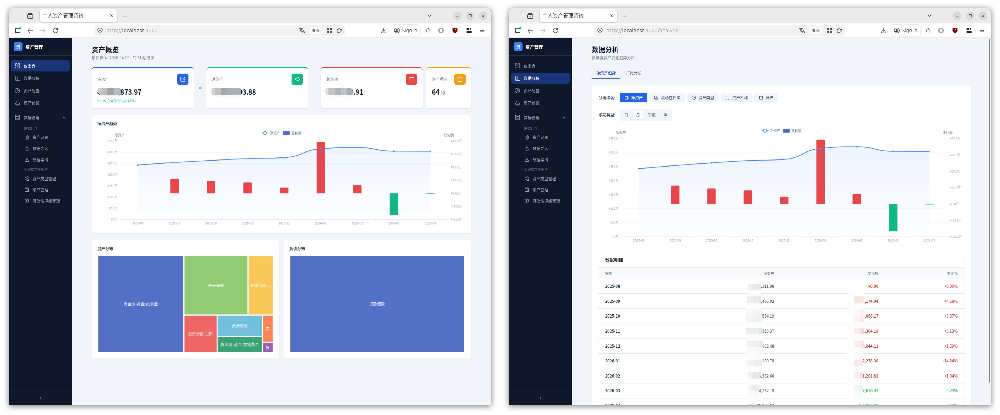
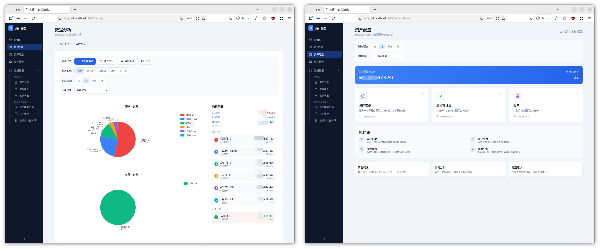
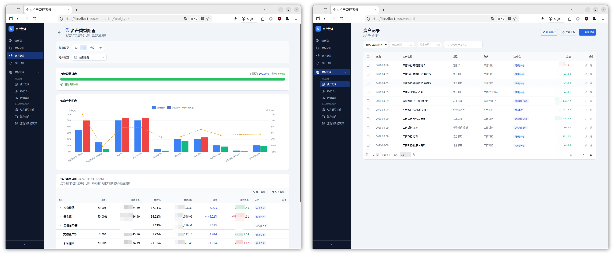
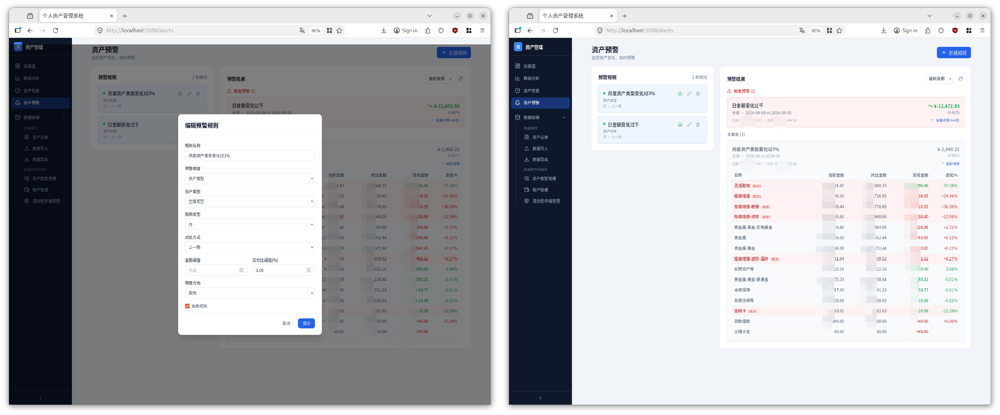
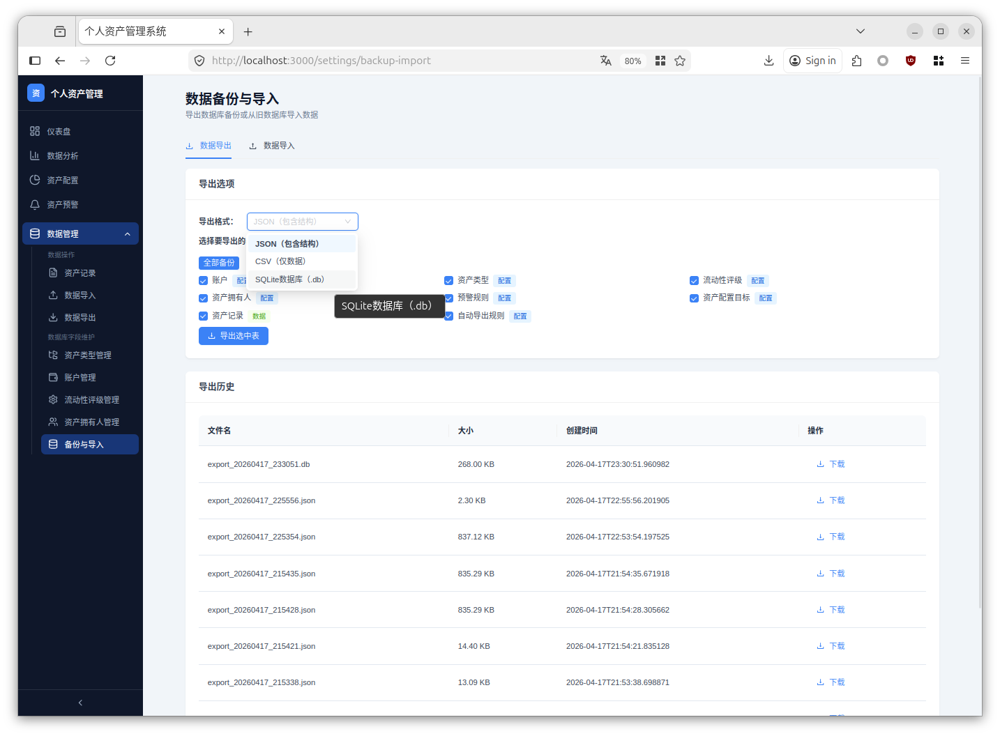
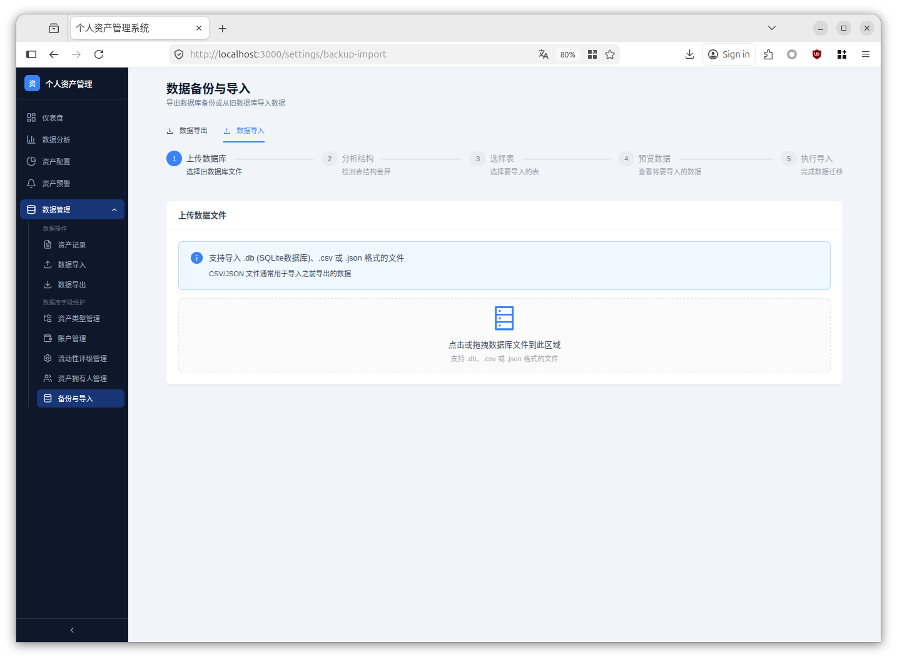
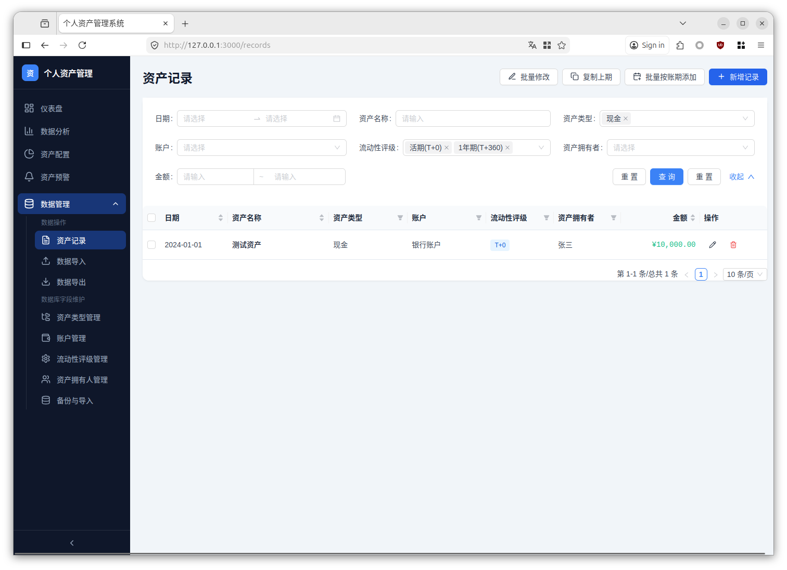
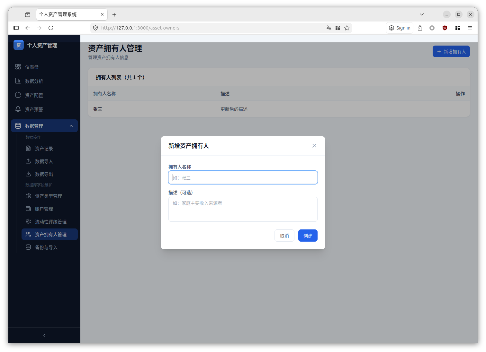
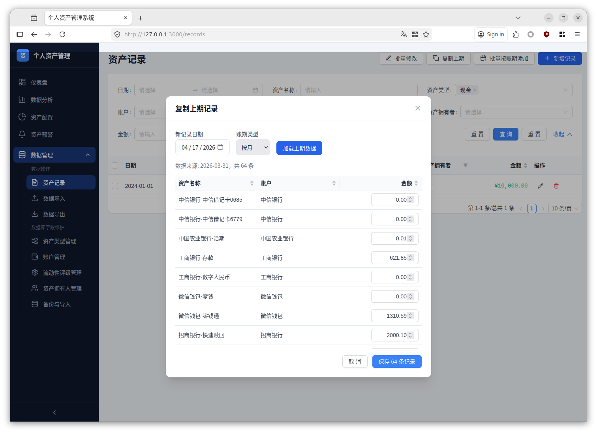

# 个人资产管理系统 (Personal Finance Management System)

<p align="center">
  
  
  
  
  
  
  
</p>

<p align="center">
  <b>一个功能完善的个人资产管理平台，支持多维度分析、资产配置、预警提醒、智能数据迁移等功能</b>
</p>

---

## 📋 目录

- [功能截图](#-功能截图)
- [功能特性](#-功能特性)
- [技术栈](#-技术栈)
- [快速开始](#-快速开始)
- [部署方式](#-部署方式)
- [项目结构](#-项目结构)
- [开发指南](#-开发指南)
- [贡献指南](#-贡献指南)
- [许可证](#-许可证)

---

## 📸 功能截图

### 资产总览
<p align="center">
  
</p>

### 多维度分析
<p align="center">
  
</p>

### 资产配置
<p align="center">
  
</p>

### 预警系统
<p align="center">
  
</p>

### 数据导出与历史记录
<p align="center">
  
</p>
<p align="center">
  <em>支持手动导出、自动导出规则配置，以及完整的导出历史记录追踪</em>
</p>


### 数据导入（智能迁移）
<p align="center">
  
</p>
<p align="center">
  <em>支持从旧数据库选择性导入，自动检测表结构差异，提供冲突解决策略</em>
</p>


### 资产记录（ProTable 高级查询）
<p align="center">
  
</p>
<p align="center">
  <em>ProTable 高级查询表单，支持多条件组合筛选、金额区间、日期范围、多选过滤</em>
</p>


### 资产拥有人管理
<p align="center">
  
</p>
<p align="center">
  <em>支持多成员资产管理，按拥有人筛选和统计，适合家庭财务管理</em>
</p>


### 复制上期记录
<p align="center">
  
</p>
<p align="center">
  <em>快速复制上期记录，支持表格排序和金额编辑，提升记账效率</em>
</p>


---

## ✨ 功能特性

### 核心功能

| 功能模块 | 描述 |
|---------|------|
| 📊 **资产记录管理** | 支持资产的增删改查、批量操作、高级查询（多条件组合筛选）、数据导入导出 |
| 📈 **多维度分析** | 支持按资产类型、流动性评级、账户、资产拥有人等维度进行趋势分析 |
| 🎯 **资产配置** | 智能资产配置目标设置，偏离分析与调整建议 |
| ⚠️ **预警系统** | 自定义预警规则，实时监控资产变动 |
| 📉 **占比分析** | 可视化展示各类资产占比，支持多层级钻取 |
| 📅 **账期管理** | 灵活的账期切换，支持日/月/季度/年度视图 |
| 💾 **数据备份与导入** | 智能数据迁移，支持选择性导入、结构差异自动处理、冲突解决策略 |
| 📜 **导出历史** | 记录所有导出操作，支持查看和追踪数据变更 |
| 👤 **资产拥有人管理** | 支持多成员资产管理，按拥有人筛选和统计 |

### 特色功能

- **智能导入**: 支持 CSV/JSON/DB 文件导入，自动识别字段映射，处理结构差异
- **导入备份**: 每次导入前自动备份数据，防止数据丢失
- **数据导出**: 支持手动导出和自动导出，可配置 Cron 表达式定时备份
- **导出历史**: 记录所有导出操作，区分手动导出和自动导出
- **数据快照**: 自动保存历史数据，支持任意时间点回溯
- **高级查询**: ProTable 高级查询表单，支持多条件组合筛选、金额区间、日期范围
- **批量操作**: 支持批量更新、批量删除，提升操作效率
- **批量修改历史**: 支持批量修改单个资产的所有历史记录属性
- **复制上期**: 快速复制上期记录，支持排序和金额编辑
- **自动数据库迁移**: 应用启动时自动检测并更新数据库结构
- **响应式设计**: 完美适配桌面端和移动端
- **实时计算**: 资产变动实时计算，即时反馈

---

## 🛠 技术栈

### 后端 (Backend)

| 技术 | 版本 | 用途 |
|------|------|------|
| [FastAPI](https://fastapi.tiangolo.com/) | 0.115.0 | 高性能 Web 框架 |
| [SQLAlchemy](https://www.sqlalchemy.org/) | 2.0.35 | ORM 数据库操作 |
| [Pydantic](https://docs.pydantic.dev/) | 2.9.2 | 数据验证与序列化 |
| [Uvicorn](https://www.uvicorn.org/) | 0.30.6 | ASGI 服务器 |
| [APScheduler](https://apscheduler.readthedocs.io/) | 3.10.0 | 定时任务调度 |
| [croniter](https://github.com/kiorky/croniter) | 1.3.0+ | Cron 表达式解析 |
| [SQLite](https://www.sqlite.org/) | - | 轻量级数据库 |

### 前端 (Frontend)

| 技术 | 版本 | 用途 |
|------|------|------|
| [Next.js](https://nextjs.org/) | 14.2.20 | React 全栈框架 |
| [React](https://react.dev/) | 18.3.1 | UI 库 |
| [Ant Design](https://ant.design/) | 6.3.5 | UI 组件库 |
| [Ant Design ProComponents](https://procomponents.ant.design/) | 3.1.12 | 高级表格和表单组件 |
| [Tailwind CSS](https://tailwindcss.com/) | 3.4.17 | 原子化 CSS |
| [ECharts](https://echarts.apache.org/) | 5.5.1 | 数据可视化 |
| [TanStack Query](https://tanstack.com/query) | 5.62.0 | 数据获取与缓存 |

---

## 🚀 快速开始

### 环境要求

- **Python**: 3.11+
- **Node.js**: 20+
- **Git**: 任意版本

### 一键启动

#### Linux / macOS

```bash
# 克隆项目
git clone https://github.com/yourusername/person_fin.git
cd person_fin

# 启动服务
./person_fin.sh start
```

#### Windows

```powershell
# 克隆项目
git clone https://github.com/yourusername/person_fin.git
cd person_fin

# 启动服务（管理员权限）
.\person_fin.ps1 start
```

### 访问服务

- 🌐 **前端界面**: http://localhost:3000
- 🔧 **后端 API**: http://localhost:8000
- 📚 **API 文档**: http://localhost:8000/docs

---

## 📦 部署方式

### 方式一：直接运行

适用于开发环境或本地测试。

```bash
# 启动
./person_fin.sh start

# 停止
./person_fin.sh stop

# 重启
./person_fin.sh restart

# 查看状态
./person_fin.sh status
```

### 方式二：Docker 部署

适用于生产环境或需要隔离的场景。

```bash
# 构建并启动
docker-compose up -d --build

# 查看日志
docker-compose logs -f

# 停止服务
docker-compose down
```

### 方式三：Windows 部署

```powershell
# 启动
.\person_fin.ps1 start

# 停止
.\person_fin.ps1 stop

# 重启
.\person_fin.ps1 restart
```

详细部署文档请参考 [DEPLOYMENT.md](./DEPLOYMENT.md)

---

## 📁 项目结构

```
person_fin/
├── 📂 backend/                 # 后端代码
│   ├── 📂 routers/            # API 路由
│   │   ├── 📄 assets.py       # 资产记录 API
│   │   ├── 📄 asset_owners.py # 资产拥有人 API
│   │   ├── 📄 imports.py      # 数据导入 API
│   │   ├── 📄 exports.py      # 数据导出 API
│   │   ├── 📄 export_history.py # 导出历史 API
│   │   ├── 📄 allocations.py  # 资产配置 API
│   │   ├── 📄 alerts.py       # 预警系统 API
│   │   └── 📄 ...
│   ├── 📂 services/           # 业务逻辑
│   │   ├── 📄 backup_service.py      # 数据备份服务
│   │   ├── 📄 auto_export_service.py # 自动导出服务
│   │   ├── 📄 scheduler_service.py   # 定时任务调度服务
│   │   ├── 📄 export_service.py      # 数据导出服务
│   │   ├── 📄 import_service.py      # 数据导入服务
│   │   ├── 📄 db_migration_service.py # 数据库迁移服务
│   │   └── 📄 asset_service.py       # 资产记录服务
│   ├── 📄 main.py             # 应用入口
│   ├── 📄 database.py         # 数据库配置
│   ├── 📄 models.py           # 数据模型
│   ├── 📄 schemas.py          # 数据验证
│   ├── 📄 requirements.txt    # Python 依赖
│   └── 📄 Dockerfile          # 后端容器配置
│
├── 📂 frontend/               # 前端代码
│   ├── 📂 src/
│   │   ├── 📂 app/           # Next.js 页面
│   │   │   ├── 📄 records/   # 资产记录页面（ProTable）
│   │   │   ├── 📄 settings/backup-import/ # 数据备份导入页面
│   │   │   └── 📄 ...
│   │   ├── 📂 components/    # React 组件
│   │   ├── 📂 hooks/         # 自定义 Hooks
│   │   ├── 📂 lib/           # 工具函数
│   │   └── 📂 types/         # TypeScript 类型
│   ├── 📄 package.json       # Node.js 依赖
│   ├── 📄 next.config.js     # Next.js 配置
│   └── 📄 Dockerfile         # 前端容器配置
│
├── 📂 data/                   # 数据文件（SQLite）
│   ├── 📂 backup/            # 导入备份目录
│   └── 📂 auto-export/       # 自动导出目录
├── 📂 import/                 # 导入文件目录
├── 📂 .trae/specs/           # 功能规格文档
├── 📄 docker-compose.yml      # Docker 编排配置
├── 📄 person_fin.sh          # Linux/macOS 启动脚本
├── 📄 person_fin.ps1         # Windows 启动脚本
├── 📄 push-to-github.sh      # GitHub 推送脚本
├── 📄 backup-and-restore.sh  # 数据备份恢复脚本
├── 📄 DEPLOYMENT.md          # 部署文档
└── 📄 README.md              # 项目说明
```

---

## 🔧 开发指南

### 后端开发

```bash
cd backend

# 创建虚拟环境
python -m venv .venv
source .venv/bin/activate  # Linux/macOS
# 或 .venv\Scripts\activate  # Windows

# 安装依赖
pip install -r requirements.txt

# 启动开发服务器
python -m uvicorn main:app --reload
```

### 前端开发

```bash
cd frontend

# 安装依赖
npm install

# 启动开发服务器
npm run dev
```

---

## 🤝 贡献指南

我们欢迎所有形式的贡献，包括但不限于：

- 🐛 提交 Bug 报告
- 💡 提出新功能建议
- 📝 改进文档
- 🔧 提交代码修复
- ✨ 添加新功能

### 贡献流程

1. Fork 本仓库
2. 创建特性分支 (`git checkout -b feature/AmazingFeature`)
3. 提交更改 (`git commit -m 'Add some AmazingFeature'`)
4. 推送到分支 (`git push origin feature/AmazingFeature`)
5. 创建 Pull Request

---

## 📝 许可证

本项目采用 [MIT 许可证](./LICENSE) 开源。

```
MIT License

Copyright (c) 2026 郝天飞（HaoTianfei）

Permission is hereby granted, free of charge, to any person obtaining a copy
of this software and associated documentation files (the "Software"), to deal
in the Software without restriction, including without limitation the rights
to use, copy, modify, merge, publish, distribute, sublicense, and/or sell
copies of the Software, and to permit persons to whom the Software is
furnished to do so, subject to the following conditions:

The above copyright notice and this permission notice shall be included in all
copies or substantial portions of the Software.
```

---

## 🙏 致谢

感谢以下开源项目和工具的支持：

- [FastAPI](https://fastapi.tiangolo.com/) - 高性能 Python Web 框架
- [Next.js](https://nextjs.org/) - React 全栈框架
- [Ant Design](https://ant.design/) - 企业级 UI 设计语言
- [Ant Design ProComponents](https://procomponents.ant.design/) - 高级表格和表单组件
- [ECharts](https://echarts.apache.org/) - 开源可视化库
- [Tailwind CSS](https://tailwindcss.com/) - 原子化 CSS 框架

---

## 📢 最近更新

### 新增功能

- **数据备份与导入**: 支持从旧数据库选择性导入，自动处理结构差异
- **资产拥有人管理**: 支持多成员资产管理
- **ProTable 高级查询**: 多条件组合筛选、金额区间、日期范围
- **自动数据库迁移**: 应用启动时自动更新数据库结构
- **复制上期记录**: 支持排序和金额编辑

### 技术改进

- 升级 Ant Design 到 v6
- 集成 ProComponents 高级组件
- 优化 Docker 构建流程

---

<p align="center">
  <b>⭐ 如果这个项目对你有帮助，请给它一个 Star！</b>
</p>

<p align="center">
  Made with ❤️ by 郝天飞(HaoTianfei)
</p>
