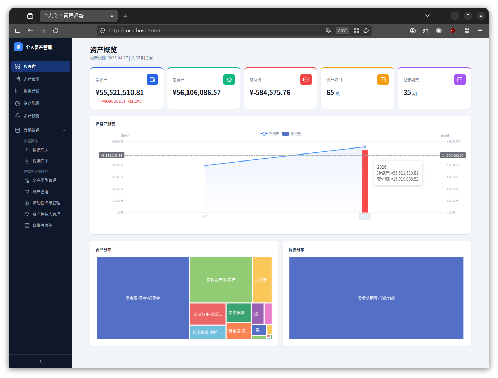
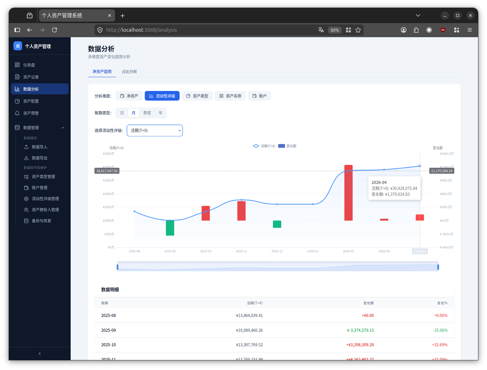
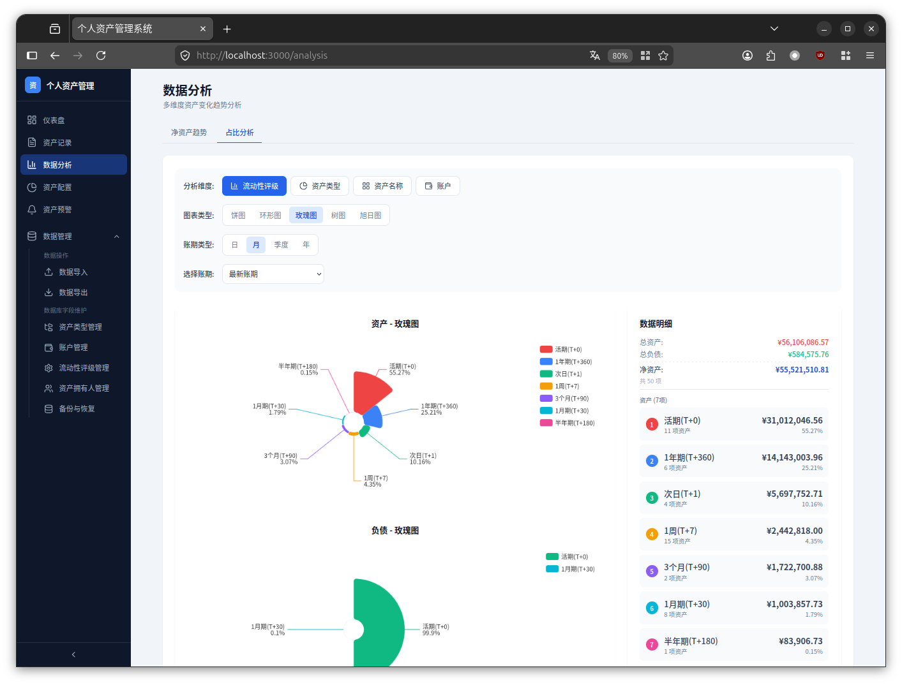
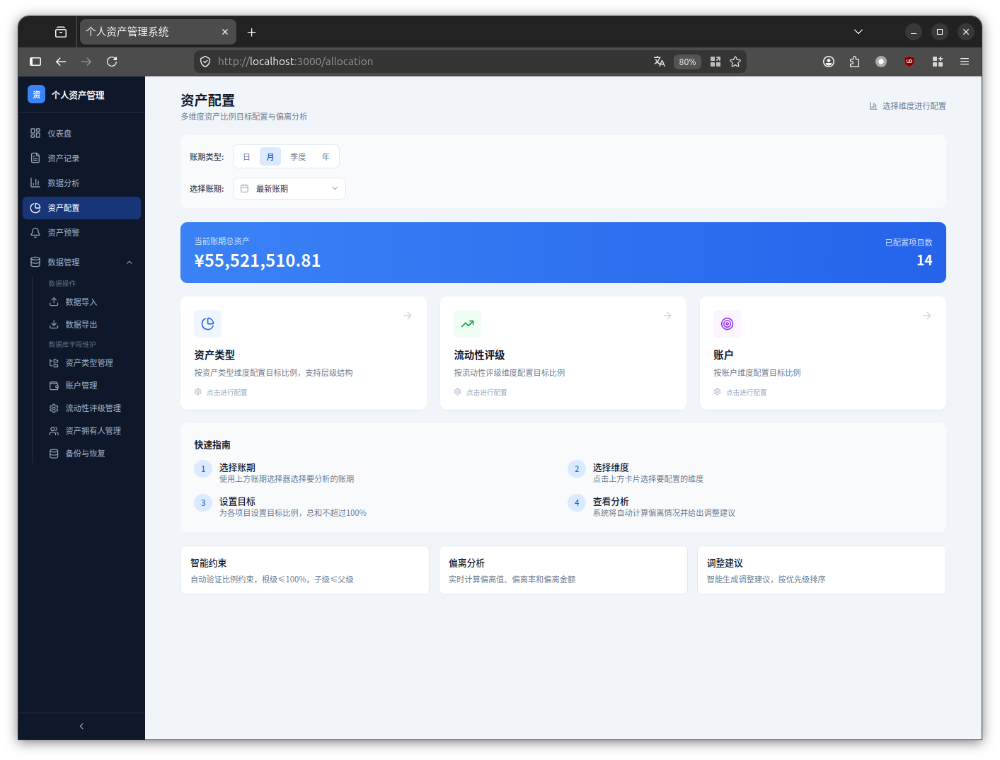
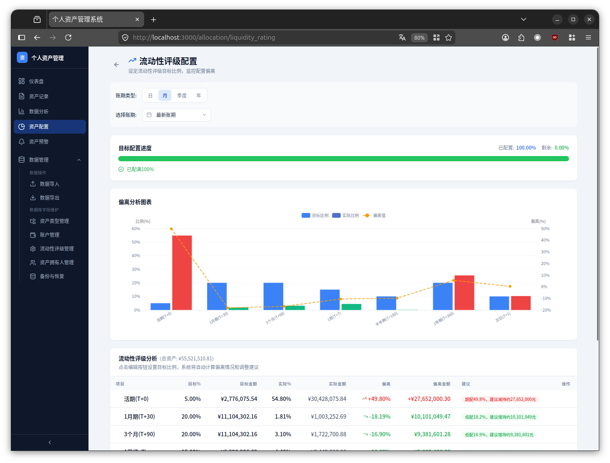
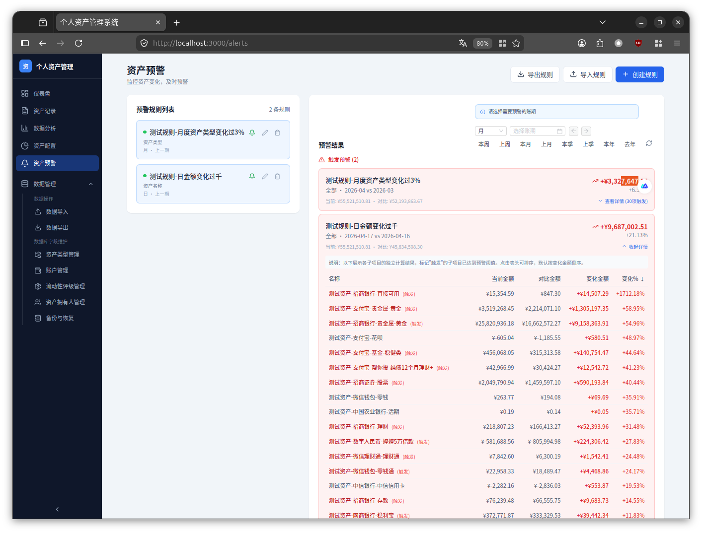
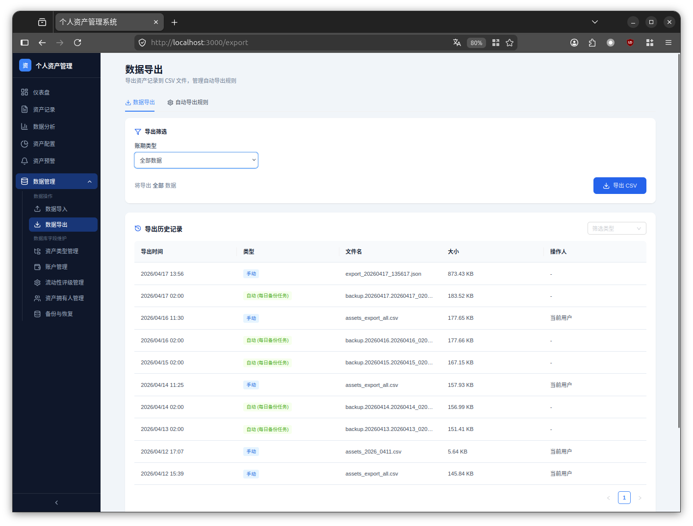
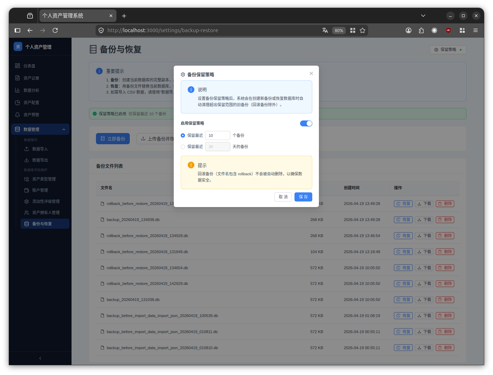
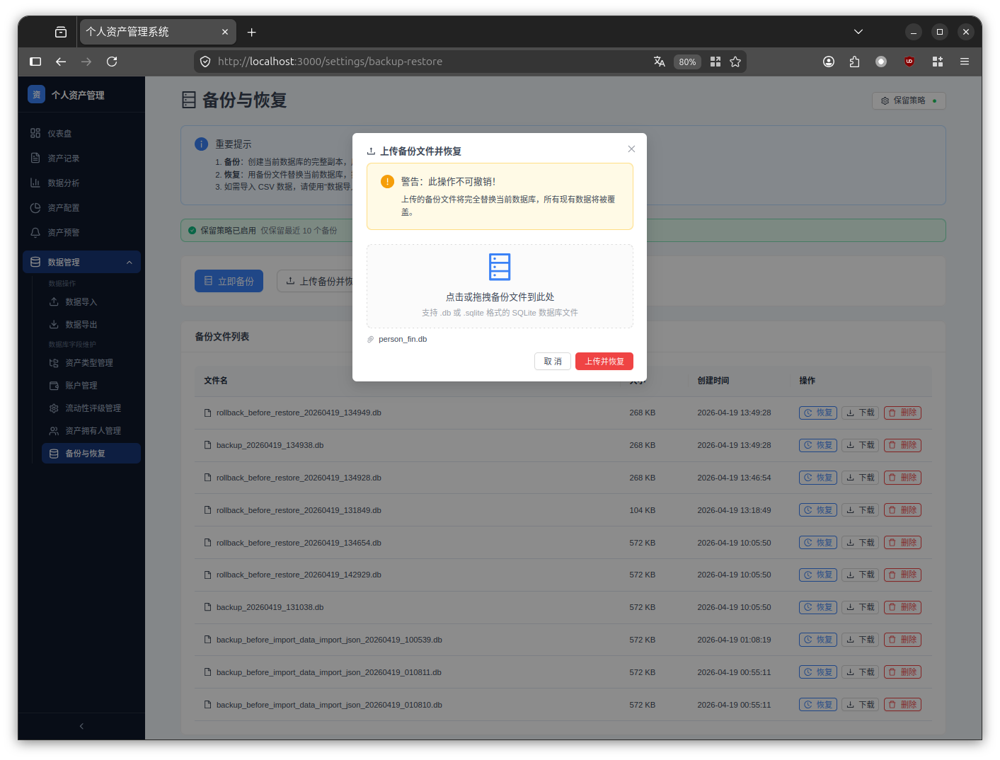

# Personal Finance Management System

<p align="center">
  
  
  
  
  
  
  
</p>

<p align="center">
  <b>A comprehensive personal asset management platform supporting multi-dimensional analysis, asset allocation, alert notifications, and intelligent data migration</b>
</p>

<p align="center">
  English | <a href="./README.md">简体中文</a>
</p>

---

## 📋 Table of Contents

- [Screenshots](#-screenshots)
- [Features](#-features)
- [Tech Stack](#-tech-stack)
- [Quick Start](#-quick-start)
- [Deployment](#-deployment)
- [Project Structure](#-project-structure)
- [Development Guide](#-development-guide)
- [Contributing](#-contributing)
- [License](#-license)

---

## 📸 Screenshots

### Asset Overview
<p align="center">
  
</p>

### Multi-dimensional Analysis
<p align="center">
  
  
</p>

### Asset Allocation
<p align="center">
  
  
</p>

### Alert System
<p align="center">
  
</p>

### Data Export & History
<p align="center">

</p>
<p align="center">
  <em>Support manual export, automatic export rule configuration, and complete export history tracking</em>
</p>

### Data Backup & Restore
<p align="center">
  
</p>
<p align="center">
  <em>Support import from old databases</em>
</p>

### Asset Records (ProTable Advanced Query)
<p align="center">
  
</p>
<p align="center">
  <em>ProTable advanced query form, supporting multi-condition combined filtering, amount range, date range, and multi-select filtering</em>
</p>

### Asset Owner Management
<p align="center">
  
</p>
<p align="center">
  <em>Support multi-member asset management, filtering and statistics by owner, suitable for family financial management</em>
</p>

### Copy Previous Period Records
<p align="center">
  
</p>
<p align="center">
  <em>Quickly copy previous period records, supporting table sorting and amount editing to improve bookkeeping efficiency</em>
</p>

---

## ✨ Features

### Core Features

| Module | Description |
|---------|------|
| 📊 **Asset Record Management** | Support CRUD operations, batch operations, advanced queries (multi-condition combined filtering), data import and export |
| 📈 **Multi-dimensional Analysis** | Trend analysis by asset type, liquidity rating, account, asset owner, and other dimensions |
| 🎯 **Asset Allocation** | Intelligent asset allocation target setting, deviation analysis and adjustment suggestions |
| ⚠️ **Alert System** | Custom alert rules, real-time monitoring of asset changes, support rule import/export |
| 📉 **Proportion Analysis** | Visual display of various asset proportions, supporting multi-level drill-down |
| 📅 **Period Management** | Flexible period switching, supporting daily/weekly/monthly/quarterly/yearly views |
| 💾 **Data Backup & Restore** | Complete database backup and restore, supporting .db format files |
| 📥 **Data Import & Export** | Intelligent data migration, supporting CSV/JSON format, selective import, automatic structure difference handling |
| 📜 **Export History** | Record all export operations, support viewing and tracking data changes |
| 👤 **Asset Owner Management** | Support multi-member asset management, filtering and statistics by owner |
| 🔄 **Copy Previous Period** | Quickly copy previous period asset records, supporting sorting and amount editing |
| ⏰ **Auto Export** | Support Cron expression configuration for scheduled automatic export tasks |

### Highlighted Features

- **Smart Import**: Support CSV/JSON/DB file import, automatic field mapping recognition, handling structure differences
- **Import Preview**: Preview data before import, automatically detect conflicts, provide skip/overwrite strategies
- **Data Backup**: Automatically backup data before each import to prevent data loss
- **Export History**: Record all export operations, distinguish between manual and automatic exports
- **Auto Export**: Support Cron expression scheduled backup, configurable filename template
- **Data Snapshots**: Automatically save historical data, support backtracking at any point in time
- **Advanced Query**: ProTable advanced query form, supporting multi-condition combined filtering, amount range, date range
- **Batch Operations**: Support batch update, batch delete to improve operational efficiency
- **Batch History Modification**: Support batch modification of all historical record attributes for a single asset
- **Alert Rule Import/Export**: Support JSON format import/export of alert rules
- **Auto Database Migration**: Automatically detect and update database structure when application starts
- **Responsive Design**: Perfectly adapted for desktop and mobile devices
- **Real-time Calculation**: Real-time calculation of asset changes, instant feedback

---

## 🛠 Tech Stack

### Backend

| Technology | Version | Purpose |
|------|------|------|
| [FastAPI](https://fastapi.tiangolo.com/) | 0.115.0 | High-performance Web framework |
| [SQLAlchemy](https://www.sqlalchemy.org/) | 2.0.35 | ORM database operations |
| [Pydantic](https://docs.pydantic.dev/) | 2.9.2 | Data validation and serialization |
| [Uvicorn](https://www.uvicorn.org/) | 0.30.6 | ASGI server |
| [APScheduler](https://apscheduler.readthedocs.io/) | 3.10.0+ | Scheduled task scheduling |
| [croniter](https://github.com/kiorky/croniter) | 1.3.0+ | Cron expression parsing |
| [SQLite](https://www.sqlite.org/) | - | Lightweight database |

### Frontend

| Technology | Version | Purpose |
|------|------|------|
| [Next.js](https://nextjs.org/) | 14.2.20 | React full-stack framework |
| [React](https://react.dev/) | 18.3.1 | UI library |
| [Ant Design](https://ant.design/) | 6.3.5 | UI component library |
| [Ant Design ProComponents](https://procomponents.ant.design/) | 3.1.12 | Advanced table and form components |
| [Tailwind CSS](https://tailwindcss.com/) | 3.4.17 | Atomic CSS |
| [ECharts](https://echarts.apache.org/) | 5.5.1 | Data visualization |
| [TanStack Query](https://tanstack.com/query) | 5.62.0 | Data fetching and caching |
| [date-fns](https://date-fns.org/) | 4.1.0 | Date processing |
| [Lucide React](https://lucide.dev/) | 0.468.0 | Icon library |

---

## 🚀 Quick Start

### Requirements

- **Python**: 3.11+
- **Node.js**: 20+
- **Git**: Any version

### One-Click Start

#### Linux / macOS

```bash
# Clone the project
git clone https://github.com/haotianfei/Personal-Finance.git
cd person_fin

# Start services
./person_fin.sh start
```

#### Windows

```powershell
# Clone the project
git clone https://github.com/haotianfei/Personal-Finance.git
cd person_fin

# Start services (Administrator privileges required)
.\person_fin.ps1 start
```

### Access Services

- 🌐 **Frontend**: http://localhost:3000
- 🔧 **Backend API**: http://localhost:8000
- 📚 **API Documentation**: http://localhost:8000/docs

---

## 📦 Deployment

### Method 1: Direct Run

Suitable for development environment or local testing.

```bash
# Start
./person_fin.sh start

# Stop
./person_fin.sh stop

# Restart
./person_fin.sh restart

# Check status
./person_fin.sh status
```

### Method 2: Docker Deployment

Suitable for production environment or scenarios requiring isolation.

```bash
# Build and start
docker-compose up -d --build

# View logs
docker-compose logs -f

# Stop services
docker-compose down
```

### Method 3: Windows Deployment

```powershell
# Start
.\person_fin.ps1 start

# Stop
.\person_fin.ps1 stop

# Restart
.\person_fin.ps1 restart
```

For detailed deployment documentation, please refer to [DEPLOYMENT.md](./DEPLOYMENT.md)

---

## 📁 Project Structure

```
person_fin/
├── 📂 backend/                 # Backend code
│   ├── 📂 routers/            # API routes
│   │   ├── 📄 assets.py       # Asset records API
│   │   ├── 📄 asset_owners.py # Asset owners API
│   │   ├── 📄 imports.py      # Data import API
│   │   ├── 📄 exports.py      # Data export API
│   │   ├── 📄 export_history.py # Export history API
│   │   ├── 📄 allocations.py  # Asset allocation API
│   │   ├── 📄 alerts.py       # Alert system API
│   │   ├── 📄 backup.py       # Backup and restore API
│   │   └── 📄 ...
│   ├── 📂 services/           # Business logic
│   │   ├── 📄 backup_service.py      # Data backup service
│   │   ├── 📄 auto_export_service.py # Auto export service
│   │   ├── 📄 scheduler_service.py   # Scheduled task service
│   │   ├── 📄 export_service.py      # Data export service
│   │   ├── 📄 import_service.py      # Data import service
│   │   ├── 📄 db_migration_service.py # Database migration service
│   │   ├── 📄 alert_service.py       # Alert service
│   │   └── 📄 asset_service.py       # Asset records service
│   ├── 📄 main.py             # Application entry
│   ├── 📄 database.py         # Database configuration
│   ├── 📄 models.py           # Data models
│   ├── 📄 schemas.py          # Data validation
│   ├── 📄 requirements.txt    # Python dependencies
│   └── 📄 Dockerfile          # Backend container config
│
├── 📂 frontend/               # Frontend code
│   ├── 📂 src/
│   │   ├── 📂 app/           # Next.js pages
│   │   │   ├── 📄 records/   # Asset records page (ProTable)
│   │   │   ├── 📄 alerts/    # Asset alerts page
│   │   │   ├── 📄 settings/backup-restore/ # Backup and restore page
│   │   │   └── 📄 ...
│   │   ├── 📂 components/    # React components
│   │   ├── 📂 lib/           # Utility functions and API
│   │   └── 📂 types/         # TypeScript types
│   ├── 📄 package.json       # Node.js dependencies
│   ├── 📄 next.config.js     # Next.js configuration
│   └── 📄 Dockerfile         # Frontend container config
│
├── 📂 data/                   # Data files (SQLite)
│   ├── 📂 backup/            # Import backup directory
│   ├── 📂 auto-export/       # Auto export directory
│   └── 📂 exports/           # Export files directory
├── 📂 images/                 # Project screenshots
├── 📂 wiki/                   # GitHub Wiki documentation
├── 📄 docker-compose.yml      # Docker compose configuration
├── 📄 person_fin.sh          # Linux/macOS startup script
├── 📄 person_fin.ps1         # Windows startup script
├── 📄 DEPLOYMENT.md          # Deployment documentation
├── 📄 TODO.md                # Feature development plan
└── 📄 README.md              # Project documentation
```

---

## 🔧 Development Guide

### Backend Development

```bash
cd backend

# Create virtual environment
python -m venv .venv
source .venv/bin/activate  # Linux/macOS
# or .venv\Scripts\activate  # Windows

# Install dependencies
pip install -r requirements.txt

# Start development server
python -m uvicorn main:app --reload
```

### Frontend Development

```bash
cd frontend

# Install dependencies
npm install

# Start development server
npm run dev
```

---

## 🤝 Contributing

We welcome all forms of contributions, including but not limited to:

- 🐛 Submitting bug reports
- 💡 Proposing new feature suggestions
- 📝 Improving documentation
- 🔧 Submitting code fixes
- ✨ Adding new features

### Contribution Process

1. Fork this repository
2. Create a feature branch (`git checkout -b feature/AmazingFeature`)
3. Commit your changes (`git commit -m 'Add some AmazingFeature'`)
4. Push to the branch (`git push origin feature/AmazingFeature`)
5. Create a Pull Request

---

## 📝 License

This project is open-sourced under the [MIT License](./LICENSE).

```
MIT License

Copyright (c) 2026 HaoTianfei

Permission is hereby granted, free of charge, to any person obtaining a copy
of this software and associated documentation files (the "Software"), to deal
in the Software without restriction, including without limitation the rights
to use, copy, modify, merge, publish, distribute, sublicense, and/or sell
copies of the Software, and to permit persons to whom the Software is
furnished to do so, subject to the following conditions:

The above copyright notice and this permission notice shall be included in all
copies or substantial portions of the Software.
```

---

## 🙏 Acknowledgements

Thanks to the following open-source projects and tools:

- [FastAPI](https://fastapi.tiangolo.com/) - High-performance Python Web framework
- [Next.js](https://nextjs.org/) - React full-stack framework
- [Ant Design](https://ant.design/) - Enterprise-class UI design language
- [Ant Design ProComponents](https://procomponents.ant.design/) - Advanced table and form components
- [ECharts](https://echarts.apache.org/) - Open-source visualization library
- [Tailwind CSS](https://tailwindcss.com/) - Atomic CSS framework

---

## 📢 Recent Updates

### New Features

- **Data Backup & Restore**: Support complete database backup and restore, .db format
- **Data Import & Export**: Support CSV/JSON format, intelligent field mapping
- **Asset Owner Management**: Support multi-member asset management
- **ProTable Advanced Query**: Multi-condition combined filtering, amount range, date range
- **Alert Rule Import/Export**: Support JSON format import/export
- **Auto Database Migration**: Automatically update database structure when application starts
- **Copy Previous Period**: Support sorting and amount editing

### Technical Improvements

- Upgrade Ant Design to v6
- Integrate ProComponents advanced components
- Optimize Docker build process
- Fix API request issues in Docker environment

---

<p align="center">
  <b>⭐ If this project helps you, please give it a Star!</b>
</p>

<p align="center">
  Made with ❤️ by HaoTianfei
</p>
